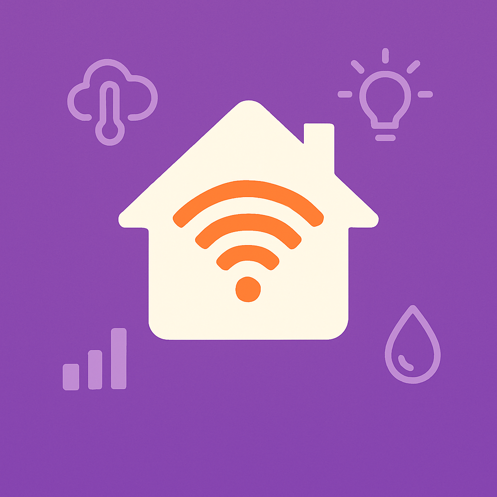

<h1 align="center">e-Ink Dashboard</h1>

# Description

Have you ever wanted a physical device, that allows you to quickly show you what's going on in your smart home?
Also, do you find e-Ink displays really cool?

Well, this is it: i'm build a smart dashboard, using a Raspberry Pi 5 (overkill, but this is what I have), and a (small for now) e-ink display.

Here is the actual todo list:

- Have something shown on display: 🟢
- Hook up a RGB LED at the same time and control it: 🟢
- Hook up physical buttons so handle navigation in the UI: 🟢
- Make an API call to a dummy site, and display data on the display: 🟢
- Render an HTML page: 🔴
- Render data from Home Assistant: 🔴
- Make it updated periodically: 🔴
- Make service boot on device startup: 🔴
- Add a IR remote to control what's shown: 🔴

## Schematics

This is currently running of a breadboard, so it'll be coming soon.

## Any question?

You can contact me using my [Portfolio](https://www.valentinvirot.fr), if you have some question about it. Have fun!
